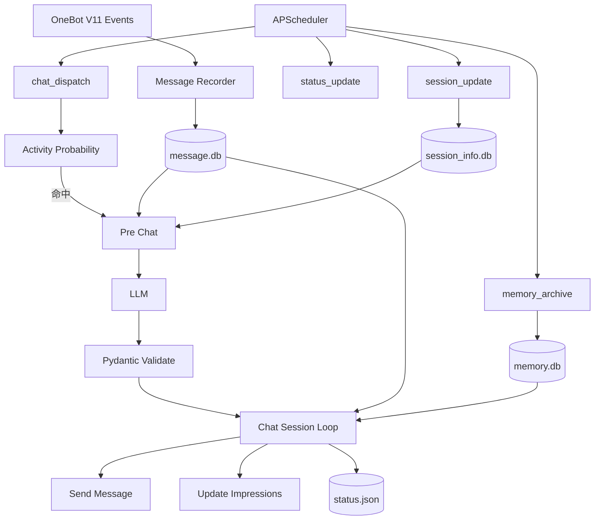

# 工作原理

25:01 的核心目标不是“被动响应消息”，而是构建一个由现实时间持续驱动的角色社交行为循环

---

## 1. 总体数据流



---

## 2. 启动过程

`bot.py`：

```text
读取 configs.json
    ↓
nonebot.init(...)
    ↓
注册 OneBot V11 Adapter
    ↓
显式 import src.plugins.living
    ↓
nonebot.run()
```

`living` 插件在 Driver Startup 时并行执行：

```text
init_memory_db()
init_session_info_db()
start_scheduler()
```

---

## 2. 日志系统

程序入口首先执行：

```text
init_log()
```

默认 NoneBot / Loguru Handler 会被移除，并重新建立两个日志输出目标：

```text
Logger
├─ Console Sink
│  └─ stdout
└─ File Sink
   └─ logs/{date}.log
```

控制台输出负责实时观察运行状态

文件输出则负责运行历史留存：

```text
DEBUG+
→ UTF-8
→ 每日 00:00 轮转
→ ZIP 压缩
→ 保留 30 天
```

文件 Sink 使用队列写入，使日志文件处理与主要异步业务流程尽量解耦

由于日志初始化位于配置读取、NoneBot 初始化和插件加载之前，所以从启动阶段开始的大部分运行异常都可以进入统一日志链路

---

## 4. 消息记录层

群消息和好友私聊首先经过会话名单 Rule

允许记录的消息会被转换为统一文本表示，并写入消息数据库

### 群消息记录

保存：

- time
- message_id
- user_id
- nickname
- content
- image_data

### 好友消息记录

保存：

- time
- message_id
- content
- image_data

如果：

```json
"enable_vision": true
```

收到的图片会下载到临时目录，并通过确定性 UUID 文件名关联到消息

这里的重要设计是：

> **收到消息 ≠ 立即请求模型。**

消息可以先作为“未读消息”留在数据库，等待角色下一次真正打开社交软件时再看到

---

## 5. 活动概率层

`scheduler_config.chat_dispatch` 决定多久检查一次

每次检查：

```python
active_value = active_probability(timestamp)
random_value = random.random()

if random_value > active_value:
    return
```

命中后才进入完整活动

### 概率模型

瞬时打开率由以下部分组成：

```text
global multiplier
× weekday multiplier
× awake weight
× (base rate + activity peak rate)
```

其中活动峰使用周期时间距离上的 Gaussian：

```text
peak = exp(-0.5 × (distance / width)²)
```

再根据轮询间隔把“每小时发生率”转换为本轮触发概率

这样可以形成“总体可预测、单次不可预测”的角色上线节奏

---

## 6. Pre Chat：打开软件与浏览主页

活动命中后：

```text
load CharacterStatus
    ↓
构造主页上下文
    ↓
pre_chat_request
    ↓
更新角色状态
    ↓
模型选择 session
```

模型看到的主要信息包括：

- 目标时间
- 历史角色状态
- 可用会话主页
- 各会话消息预览
- 未读数量
- 群聊印象 / 好友画像
- Location 候选

### Pre Chat Prompt 拼接顺序

System：

```text
common/core.md
→ preset.md
→ common/state.md
→ task/pre_chat.md
```

User：

```text
目标时间
→ 历史角色状态
→ 消息主页
→ Location 补充
```

最终输出必须符合 `PreChatValidate`：

```text
new_status
session
```

`session` 还会再次校验是否位于允许名单中

---

## 7. Chat Session Loop

进入会话后最多执行：

```json
"max_session_rounds": 5
```

轮

每轮：

```text
构造当前会话上下文
    ↓
请求 LLM
    ↓
校验结构化输出
    ↓
写回 new_status
    ↓
将本轮未读消息标为已读
    ↓
更新用户印象 / 群聊印象
    ↓
按 chat 决定是否发送消息
    ↓
执行 next_action
```

### Chat Prompt 拼接顺序

System：

```text
common/core.md
→ preset.md
→ common/state.md
→ common/chat.md
→ task/group_chat.md 或 task/friend_chat.md
```

User：

```text
目标时间
→ 历史角色状态
→ 消息主页
→ 当前聊天信息
→ 聊天记录
→ 用户画像 / 记忆 / 印象
→ Location 补充
→ Image 补充
```

---

## 8. chat 与 next_action 是两个维度

聊天输出不是简单的“回复 / 不回复”

模型需要分别决定：

```text
chat: true / false
```

以及：

```text
next_action:
  exit
  stay
  switch
```

因此可能出现：

```text
不发言 + 退出
不发言 + 切换
发言 + 退出
发言 + 停留
发言 + 切换
```

这使“是否开口”和“是否继续浏览社交软件”解耦

---

## 9. Stay

当模型返回：

```json
{
  "type": "stay"
}
```

程序不会立即再次请求，而是在：

```json
"stay_interval_range": {
  "min": 120,
  "max": 180
}
```

之间随机等待，再继续下一轮

它模拟角色停留在当前会话中继续观察的过程，并避免瞬间连续调用模型

---

## 10. Switch

当返回：

```json
{
  "type": "switch",
  "session": {
    "type": "group",
    "id": 123
  }
}
```

程序直接把当前会话切换为目标会话

目标仍由 `Session` Schema 校验，不能跳到未授权会话

---

## 11. 消息发送

`afterprocess.handle_and_send_msg()` 支持：

### 群聊

- text
- at
- reply
- image

### 好友聊天

- text
- reply
- image

预设图片流程：

```text
image_id
→ image_metadata.json
→ meta_image 文件
→ 转临时文件
→ Base64
→ OneBot Image Segment
```

发送前会按文字长度增加模拟输入等待：

```text
max(text_length / 4, 1)
```

发送成功后，机器人自己的消息也会写回消息数据库

---

## 12. 角色状态

`CharacterStatus` 是一个持续存在的完整状态对象

每次：

- pre_chat
- chatting
- status_update

都会要求模型返回**完整 `new_status`**

保存位置由：

```text
chat_config.status_path
```

指定。

不存在状态文件时，会从：

```text
setting_config.default_status
```

冷启动

---

## 13. 独立状态更新

`status_update` 不依赖聊天触发

Prompt：

```text
common/core.md
→ preset.md
→ common/state.md
→ task/status_update.md
```

输入：

```text
目标时间
→ 历史状态
→ Location 补充
```

它负责让“角色在不聊天时仍然继续生活”

---

## 14. 记忆系统

项目维护三个层次：

```text
即时消息
    ↓
事件印象
    ↓
长期记忆 + 用户画像
```

聊天阶段主要形成 / 更新“印象”

`memory_archive` 定时把已有长期记忆和新印象交给模型重新整理

为了控制上下文量，用户会按照：

```json
"max_memory_user_counts": 20
```

分批归档

模型必须对输入用户一一返回：

```text
user_id
portrait
memory
```

程序会验证：

- 是否存在重复 user_id
- 是否缺少输入用户
- 是否返回额外用户

验证通过后才覆盖写入长期记忆

---

## 15. 会话信息同步

`session_update` 调用 OneBot API：

```text
get_group_list
get_friend_list
```

并将当前允许会话的：

- 群名称
- 群人数
- 好友昵称

写入 `session_info.db`

因此主页展示使用的是实际 QQ 会话元数据，而不是完全依赖 Prompt 猜测

---

## 16. Scheduler 与并发

项目使用独立 `AsyncIOScheduler`

三个可能发起较重业务的任务：

```text
memory_archive
chat_dispatch
status_update
```

进入同一个：

```text
SharedLimitAsyncIOExecutor(max_instances=1)
```

因此共享并发上限为 1

相同执行时间下由 Priority JobStore 排序：

```text
memory_archive    priority = 3
chat_dispatch     priority = 2
status_update     priority = 1
```

`session_update` 不走 shared executor

该机制避免状态更新、记忆归档和主动聊天同时修改共享状态

---

## 17. 数据持久化职责

| 文件 | 作用 |
| --- | --- |
| `message.db` | 群聊 / 私聊消息与已读状态 |
| `memory.db` | 用户画像、长期记忆与印象 |
| `session_info.db` | 群 / 好友元信息 |
| `status.json` | 当前完整角色状态 |
| `location.json` | Location 候选 |
| `image_metadata.json` | 预设图片索引 |

---

## 18. 总结

```text
25:01 = 时间驱动 + 状态持续化 + 概率活动 + 自主会话导航 + 分层记忆 + 结构化约束
```

它不是让模型“假装在线”，而是让在线行为成为一个有上下文、有时间成本、也可以选择沉默的角色行为